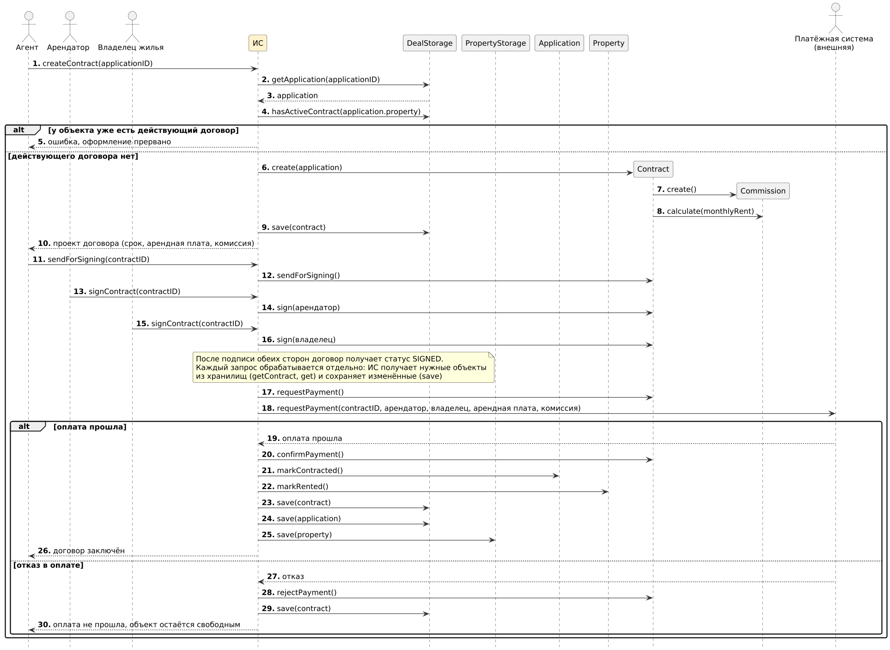

```plantuml
@startuml
skinparam defaultFontName DejaVu Sans
skinparam defaultFontSize 14
skinparam shadowing false
skinparam dpi 110
skinparam roundCorner 6
skinparam backgroundColor white
skinparam ArrowColor #333333
skinparam sequence {
  LifeLineBorderColor #333333
  ParticipantBorderColor #333333
  ParticipantBackgroundColor #F1F1F1
  ActorBorderColor #333333
  ActorBackgroundColor #F1F1F1
  BoxBorderColor #333333
}
skinparam participant<<IS>> {
  BackgroundColor #FFF2CC
}
autonumber "<b>0."
hide footbox
hide stereotype
actor "Агент" as A
actor "Арендатор" as T
actor "Владелец жилья" as O
participant "ИС" as IS <<IS>>
participant "DealStorage" as DS
participant "PropertyStorage" as PS
participant "Application" as AP
participant "Property" as P
participant "Contract" as C
participant "Commission" as CM
actor "Платёжная система\n(внешняя)" as PAY

A -> IS : createContract(applicationID)
IS -> DS : getApplication(applicationID)
DS --> IS : application
IS -> DS : hasActiveContract(application.property)
alt у объекта уже есть действующий договор
  IS --> A : ошибка, оформление прервано
else действующего договора нет
  IS -> C ** : create(application)
  C -> CM ** : create()
  C -> CM : calculate(monthlyRent)
  IS -> DS : save(contract)
  IS --> A : проект договора (срок, арендная плата, комиссия)

  A -> IS : sendForSigning(contractID)
  IS -> C : sendForSigning()
  T -> IS : signContract(contractID)
  IS -> C : sign(арендатор)
  O -> IS : signContract(contractID)
  IS -> C : sign(владелец)
  note over IS, DS : После подписи обеих сторон договор получает статус SIGNED.\nКаждый запрос обрабатывается отдельно: ИС получает нужные объекты\nиз хранилищ (getContract, get) и сохраняет изменённые (save)

  IS -> C : requestPayment()
  IS -> PAY : requestPayment(contractID, арендатор, владелец, арендная плата, комиссия)

  alt оплата прошла
    PAY --> IS : оплата прошла
    IS -> C : confirmPayment()
    IS -> AP : markContracted()
    IS -> P : markRented()
    IS -> DS : save(contract)
    IS -> DS : save(application)
    IS -> PS : save(property)
    IS --> A : договор заключён
  else отказ в оплате
    PAY --> IS : отказ
    IS -> C : rejectPayment()
    IS -> DS : save(contract)
    IS --> A : оплата не прошла, объект остаётся свободным
  end
end
@enduml
```