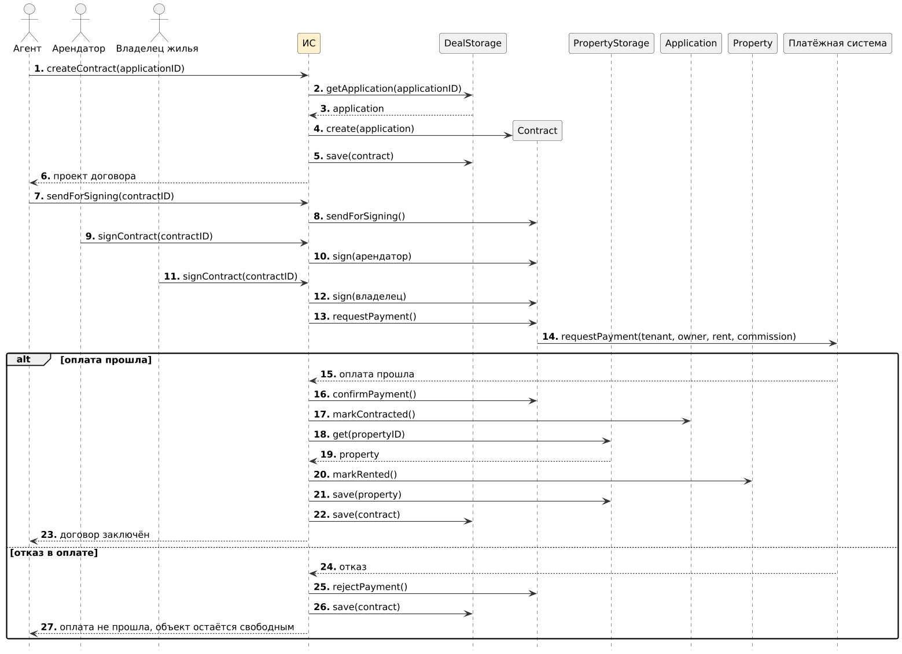

```plantuml
@startuml
skinparam defaultFontName DejaVu Sans
skinparam defaultFontSize 14
skinparam shadowing false
skinparam dpi 110
skinparam roundCorner 6
skinparam backgroundColor white
skinparam ArrowColor #333333
skinparam sequence {
  LifeLineBorderColor #333333
  ParticipantBorderColor #333333
  ParticipantBackgroundColor #F1F1F1
  ActorBorderColor #333333
  ActorBackgroundColor #F1F1F1
  BoxBorderColor #333333
}
skinparam participant<<IS>> {
  BackgroundColor #FFF2CC
}
autonumber "<b>0."
hide footbox
hide stereotype
actor "Агент" as A
actor "Арендатор" as T
actor "Владелец жилья" as O
participant "ИС" as IS <<IS>>
participant "DealStorage" as DS
participant "Contract" as C
participant "PropertyStorage" as PS
participant "Application" as AP
participant "Property" as P
participant "Платёжная система" as PAY

A -> IS : createContract(applicationID)
IS -> DS : getApplication(applicationID)
DS --> IS : application
IS -> C ** : create(application)
IS -> DS : save(contract)
IS --> A : проект договора

A -> IS : sendForSigning(contractID)
IS -> C : sendForSigning()
T -> IS : signContract(contractID)
IS -> C : sign(арендатор)
O -> IS : signContract(contractID)
IS -> C : sign(владелец)

IS -> C : requestPayment()
C -> PAY : requestPayment(tenant, owner, rent, commission)
alt оплата прошла
  PAY --> IS : оплата прошла
  IS -> C : confirmPayment()
  IS -> AP : markContracted()
  IS -> PS : get(propertyID)
  PS --> IS : property
  IS -> P : markRented()
  IS -> PS : save(property)
  IS -> DS : save(contract)
  IS --> A : договор заключён
else отказ в оплате
  PAY --> IS : отказ
  IS -> C : rejectPayment()
  IS -> DS : save(contract)
  IS --> A : оплата не прошла, объект остаётся свободным
end
@enduml
```
