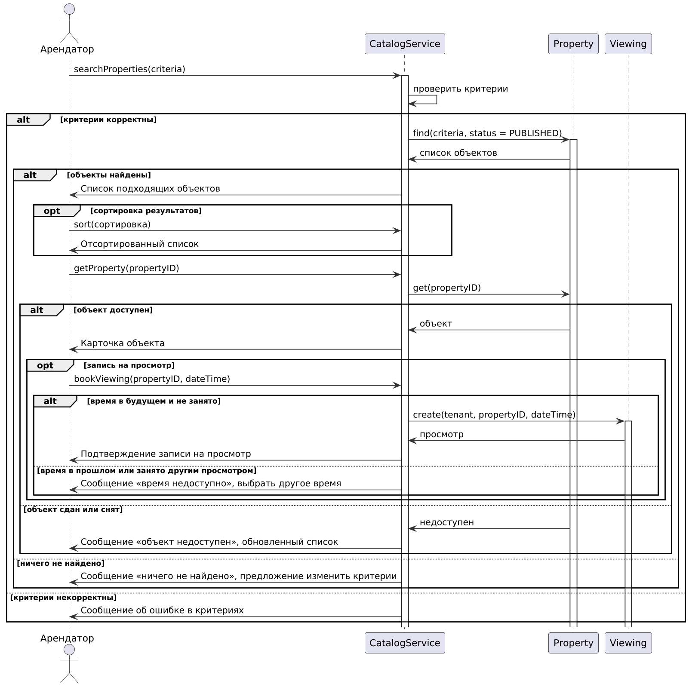

```plantuml
@startuml
skinparam defaultFontName DejaVu Sans
skinparam shadowing false
skinparam dpi 150
skinparam ArrowColor #333333
skinparam backgroundColor white

actor Арендатор

Арендатор -> CatalogService : searchProperties(criteria)
activate CatalogService
CatalogService -> CatalogService : проверить критерии
alt критерии корректны
CatalogService -> Property : find(criteria, status = PUBLISHED)
activate Property
CatalogService <- Property : список объектов
alt объекты найдены
Арендатор <- CatalogService : Список подходящих объектов
opt сортировка результатов
Арендатор -> CatalogService : sort(сортировка)
Арендатор <- CatalogService : Отсортированный список
end
Арендатор -> CatalogService : getProperty(propertyID)
CatalogService -> Property : get(propertyID)
alt объект доступен
CatalogService <- Property : объект
Арендатор <- CatalogService : Карточка объекта
opt запись на просмотр
Арендатор -> CatalogService : bookViewing(propertyID, dateTime)
alt время в будущем и не занято
CatalogService -> Viewing : create(tenant, propertyID, dateTime)
activate Viewing
CatalogService <- Viewing : просмотр
Арендатор <- CatalogService : Подтверждение записи на просмотр
else время в прошлом или занято другим просмотром
Арендатор <- CatalogService : Сообщение «время недоступно», выбрать другое время
end
end
else объект сдан или снят
CatalogService <- Property : недоступен
Арендатор <- CatalogService : Сообщение «объект недоступен», обновленный список
end
else ничего не найдено
Арендатор <- CatalogService : Сообщение «ничего не найдено», предложение изменить критерии
end
else критерии некорректны
Арендатор <- CatalogService : Сообщение об ошибке в критериях
end
@enduml
```
