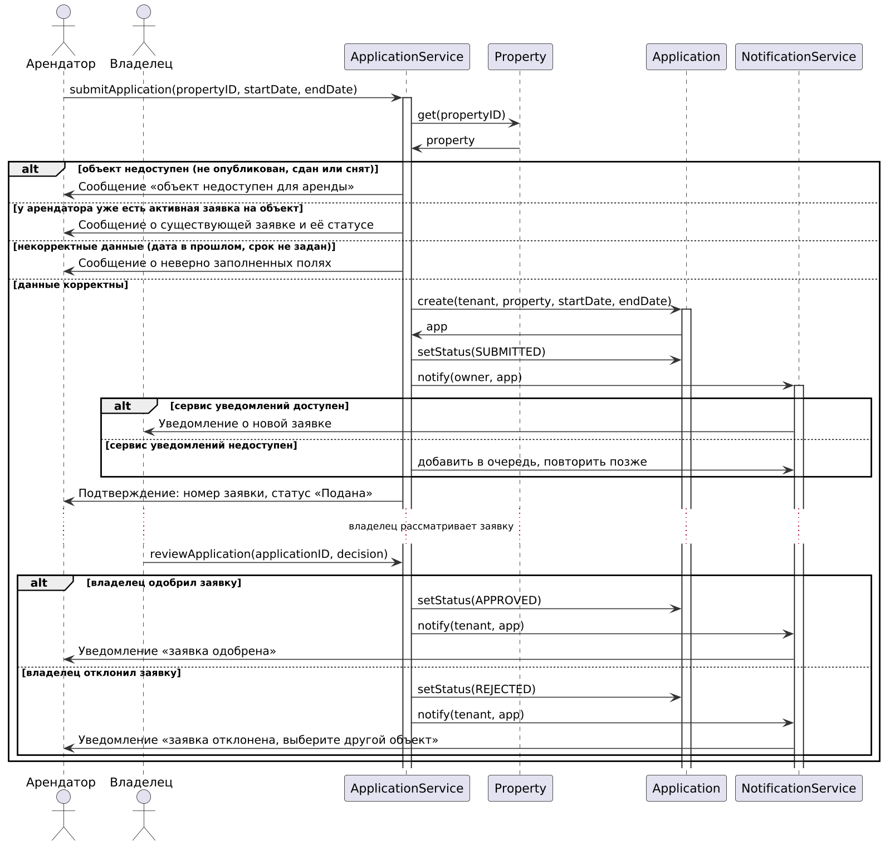

```plantuml
@startuml
skinparam defaultFontName DejaVu Sans
skinparam shadowing false
skinparam dpi 150
skinparam ArrowColor #333333
skinparam backgroundColor white

actor Арендатор
actor Владелец

Арендатор -> ApplicationService : submitApplication(propertyID, startDate, endDate)
activate ApplicationService
ApplicationService -> Property : get(propertyID)
ApplicationService <- Property : property
alt объект недоступен (не опубликован, сдан или снят)
Арендатор <- ApplicationService : Сообщение «объект недоступен для аренды»
else у арендатора уже есть активная заявка на объект
Арендатор <- ApplicationService : Сообщение о существующей заявке и её статусе
else некорректные данные (дата в прошлом, срок не задан)
Арендатор <- ApplicationService : Сообщение о неверно заполненных полях
else данные корректны
ApplicationService -> Application : create(tenant, property, startDate, endDate)
activate Application
ApplicationService <- Application : app
ApplicationService -> Application : setStatus(SUBMITTED)
ApplicationService -> NotificationService : notify(owner, app)
activate NotificationService
alt сервис уведомлений доступен
NotificationService -> Владелец : Уведомление о новой заявке
else сервис уведомлений недоступен
ApplicationService -> NotificationService : добавить в очередь, повторить позже
end
Арендатор <- ApplicationService : Подтверждение: номер заявки, статус «Подана»
... владелец рассматривает заявку ...
Владелец -> ApplicationService : reviewApplication(applicationID, decision)
alt владелец одобрил заявку
ApplicationService -> Application : setStatus(APPROVED)
ApplicationService -> NotificationService : notify(tenant, app)
NotificationService -> Арендатор : Уведомление «заявка одобрена»
else владелец отклонил заявку
ApplicationService -> Application : setStatus(REJECTED)
ApplicationService -> NotificationService : notify(tenant, app)
NotificationService -> Арендатор : Уведомление «заявка отклонена, выберите другой объект»
end
end
@enduml
```
