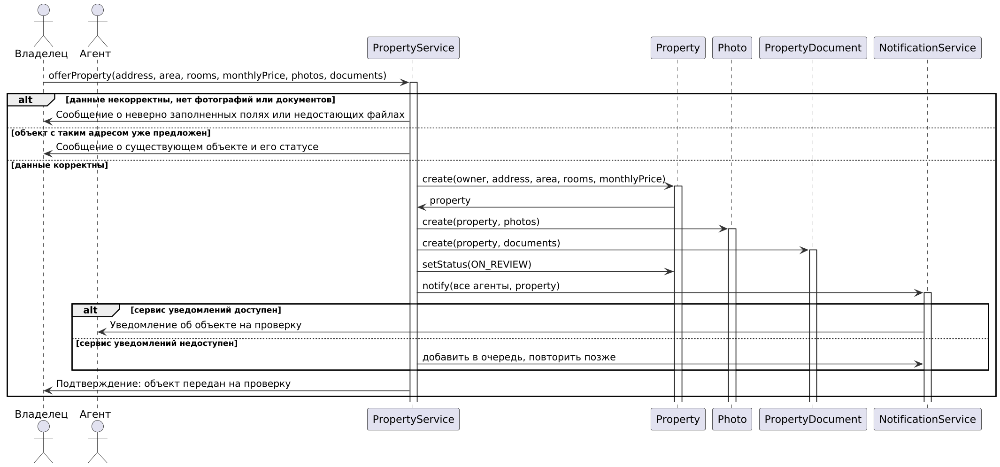
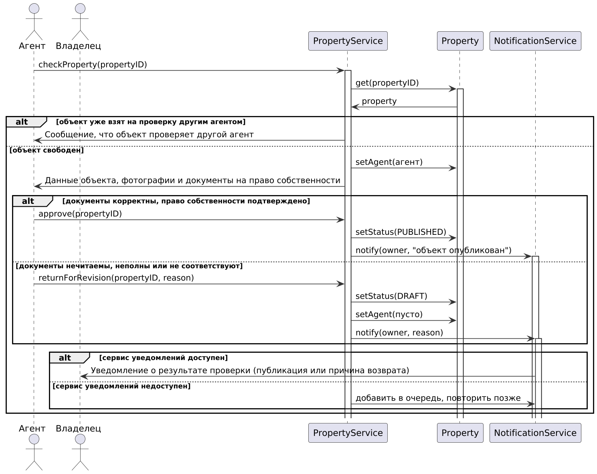

Диаграмма 1. Предложение жилья (системная операция offerProperty, шаги 1-6 сценария)

```plantuml
@startuml
skinparam defaultFontName DejaVu Sans
skinparam shadowing false
skinparam dpi 150
skinparam ArrowColor #333333
skinparam backgroundColor white

actor Владелец
actor Агент

Владелец -> PropertyService : offerProperty(address, area, rooms, monthlyPrice, photos, documents)
activate PropertyService
alt данные некорректны, нет фотографий или документов
Владелец <- PropertyService : Сообщение о неверно заполненных полях или недостающих файлах
else объект с таким адресом уже предложен
Владелец <- PropertyService : Сообщение о существующем объекте и его статусе
else данные корректны
PropertyService -> Property : create(owner, address, area, rooms, monthlyPrice)
activate Property
PropertyService <- Property : property
PropertyService -> Photo : create(property, photos)
activate Photo
PropertyService -> PropertyDocument : create(property, documents)
activate PropertyDocument
PropertyService -> Property : setStatus(ON_REVIEW)
PropertyService -> NotificationService : notify(все агенты, property)
activate NotificationService
alt сервис уведомлений доступен
NotificationService -> Агент : Уведомление об объекте на проверку
else сервис уведомлений недоступен
PropertyService -> NotificationService : добавить в очередь, повторить позже
end
Владелец <- PropertyService : Подтверждение: объект передан на проверку
end
@enduml
```

Диаграмма 2. Проверка объекта и документов агентом (шаги 7-10 сценария)

```plantuml
@startuml
skinparam defaultFontName DejaVu Sans
skinparam shadowing false
skinparam dpi 150
skinparam ArrowColor #333333
skinparam backgroundColor white

actor Агент
actor Владелец

Агент -> PropertyService : checkProperty(propertyID)
activate PropertyService
PropertyService -> Property : get(propertyID)
activate Property
PropertyService <- Property : property
alt объект уже взят на проверку другим агентом
Агент <- PropertyService : Сообщение, что объект проверяет другой агент
else объект свободен
PropertyService -> Property : setAgent(агент)
Агент <- PropertyService : Данные объекта, фотографии и документы на право собственности
alt документы корректны, право собственности подтверждено
Агент -> PropertyService : approve(propertyID)
PropertyService -> Property : setStatus(PUBLISHED)
PropertyService -> NotificationService : notify(owner, "объект опубликован")
activate NotificationService
else документы нечитаемы, неполны или не соответствуют
Агент -> PropertyService : returnForRevision(propertyID, reason)
PropertyService -> Property : setStatus(DRAFT)
PropertyService -> Property : setAgent(пусто)
PropertyService -> NotificationService : notify(owner, reason)
activate NotificationService
end
alt сервис уведомлений доступен
NotificationService -> Владелец : Уведомление о результате проверки (публикация или причина возврата)
else сервис уведомлений недоступен
PropertyService -> NotificationService : добавить в очередь, повторить позже
end
end
@enduml
```
