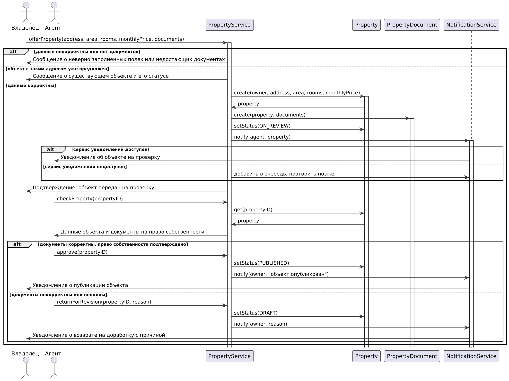

```plantuml
@startuml
skinparam defaultFontName DejaVu Sans
skinparam shadowing false
skinparam dpi 150
skinparam ArrowColor #333333
skinparam backgroundColor white

actor Владелец
actor Агент

Владелец -> PropertyService : offerProperty(address, area, rooms, monthlyPrice, documents)
activate PropertyService
alt данные некорректны или нет документов
Владелец <- PropertyService : Сообщение о неверно заполненных полях или недостающих документах
else объект с таким адресом уже предложен
Владелец <- PropertyService : Сообщение о существующем объекте и его статусе
else данные корректны
PropertyService -> Property : create(owner, address, area, rooms, monthlyPrice)
activate Property
PropertyService <- Property : property
PropertyService -> PropertyDocument : create(property, documents)
activate PropertyDocument
PropertyService -> Property : setStatus(ON_REVIEW)
PropertyService -> NotificationService : notify(agent, property)
activate NotificationService
alt сервис уведомлений доступен
NotificationService -> Агент : Уведомление об объекте на проверку
else сервис уведомлений недоступен
PropertyService -> NotificationService : добавить в очередь, повторить позже
end
Владелец <- PropertyService : Подтверждение: объект передан на проверку
Агент -> PropertyService : checkProperty(propertyID)
PropertyService -> Property : get(propertyID)
PropertyService <- Property : property
Агент <- PropertyService : Данные объекта и документы на право собственности
alt документы корректны, право собственности подтверждено
Агент -> PropertyService : approve(propertyID)
PropertyService -> Property : setStatus(PUBLISHED)
PropertyService -> NotificationService : notify(owner, "объект опубликован")
NotificationService -> Владелец : Уведомление о публикации объекта
else документы некорректны или неполны
Агент -> PropertyService : returnForRevision(propertyID, reason)
PropertyService -> Property : setStatus(DRAFT)
PropertyService -> NotificationService : notify(owner, reason)
NotificationService -> Владелец : Уведомление о возврате на доработку с причиной
end
end
@enduml
```
