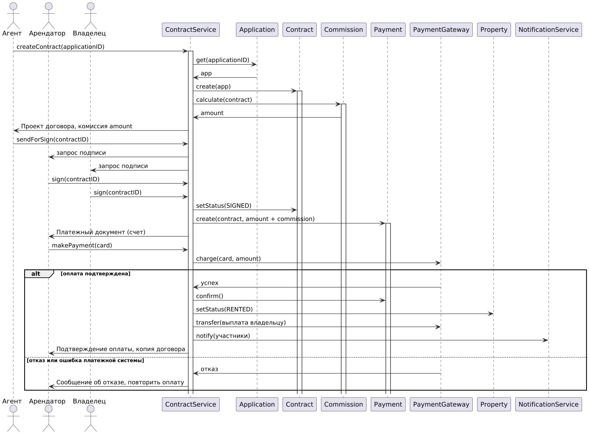

```plantuml
@startuml
skinparam defaultFontName DejaVu Sans
skinparam shadowing false
skinparam dpi 150
skinparam ArrowColor #333333
skinparam backgroundColor white

actor Агент
actor Арендатор
actor Владелец

Агент -> ContractService : createContract(applicationID)
activate ContractService
ContractService -> Application : get(applicationID)
ContractService <- Application : app
ContractService -> Contract : create(app)
activate Contract
ContractService -> Commission : calculate(contract)
activate Commission
ContractService <- Commission : amount
Агент <- ContractService : Проект договора, комиссия amount
Агент -> ContractService : sendForSign(contractID)
ContractService -> Арендатор : запрос подписи
ContractService -> Владелец : запрос подписи
Арендатор -> ContractService : sign(contractID)
Владелец -> ContractService : sign(contractID)
ContractService -> Contract : setStatus(SIGNED)
ContractService -> Payment : create(contract, amount + commission)
activate Payment
Арендатор <- ContractService : Платежный документ (счет)
Арендатор -> ContractService : makePayment(card)
ContractService -> PaymentGateway : charge(card, amount)
alt оплата подтверждена
ContractService <- PaymentGateway : успех
ContractService -> Payment : confirm()
ContractService -> Property : setStatus(RENTED)
ContractService -> PaymentGateway : transfer(выплата владельцу)
ContractService -> NotificationService : notify(участники)
Арендатор <- ContractService : Подтверждение оплаты, копия договора
else отказ или ошибка платежной системы
ContractService <- PaymentGateway : отказ
Арендатор <- ContractService : Сообщение об отказе, повторить оплату
end
@enduml
```
